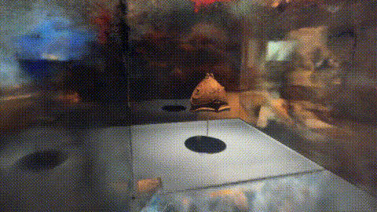
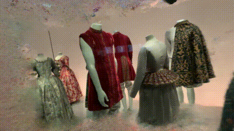

# AI4Heritage - Nerfstudio Demo
## Visual Examples

<!--- poner originales -->

The following renders have been done using [Nerfacto](https://docs.nerf.studio/en/latest/nerfology/methods/nerfacto.html) over Nerfstudio scenes and our own captures from the Design and Archeological Museums of Barcelona.

<!--- 
) 
-->
## Benchmarking

### Nerfstudio scene benchmarks
### Our scene benchmarks
### 3D benchmarks

## Other applications (i.e. depth & segmentation)

## Usage (Scripts)

