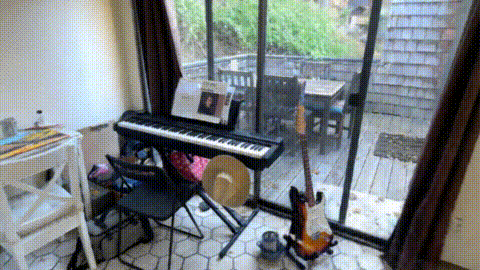
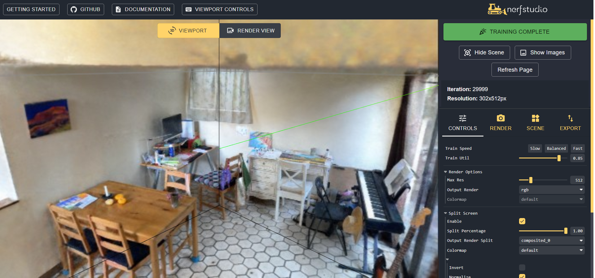
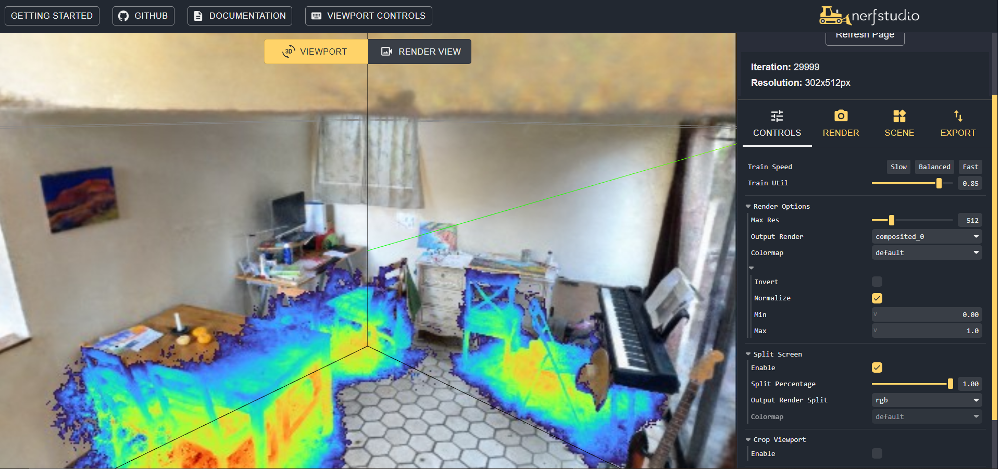
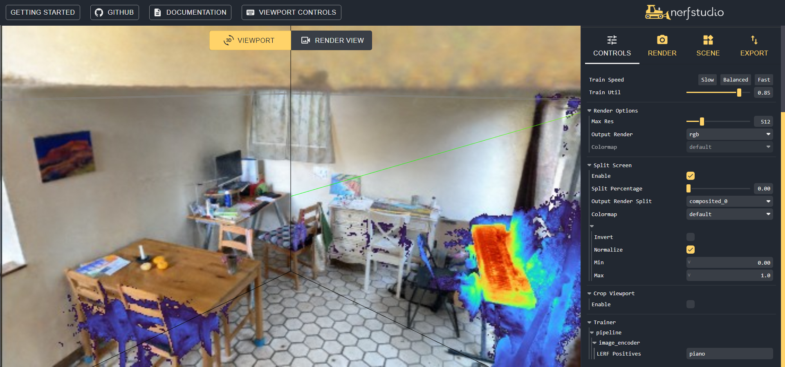

# AI4Heritage - Nerfstudio Demo
## Visual Examples


The following renders have been done using [Nerfacto](https://docs.nerf.studio/en/latest/nerfology/methods/nerfacto.html) over Nerfstudio scenes and our own captures from the Design and Archeological Museums of Barcelona.




## Usage (Scripts)

### Preprocessing scenes of videos and images
Use `process_data.sh` to use `ns-process`, specifying the `GPU`, `TYPE` (whether 'images' or 'video') and `DATASET` (scene folder), for example:
```
sh process_data.sh 0 images data/nerfstudio/kitchen
```
For processing an entire dataset (folder of scenes), use `all_process.sh` specifying the `GPU`, `FOLDER` (folder with scenes) and whether to `OVERWRITE` your processed files:
```
sh all_process.sh 0 data/nerfstudio
```
The script `whole_process.sh` will read all folders in `data/`, so that if you want to run all examples that exist in your `data` folder, then:
```
sh whole_process.sh 0
```

### Training Nerfs from images and videos

Use `train.sh` to use `ns-train`, specifying the `GPU`, `MODEL` and `DATASET` (scene folder), for example:
```
sh train.sh 0 nerfacto data/nerfstudio/kitchen
```
For training an entire dataset (folder of scenes), use `all_train.sh` specifying the `GPU`, `MODEL`, `FOLDER` (folder with scenes) and whether to `OVERWRITE` your outputs:
```
sh all_train.sh 0 nerfacto data/nerfstudio true
```
The script `whole_train.sh` will read all folders in `data/`, so that if you want to run all examples that exist in your `data` folder, then:
```
sh whole_train.sh 0 nerfacto
```
### Rendering scenes as videos and gifs

Use `render.sh` to use `ns-render`, specifying the `GPU`, `MODEL`, `DATASET` (scene folder), `RESOL` for resolution scaling (default 1) and `OVERWRITE`:
```
sh render.sh 0 nerfacto data/nerfstudio/kitchen 1 false
```
For rendering all output files, use `all_render.sh` specifying the `GPU`, `RESOL` and whether to `OVERWRITE` your outputs:
```
sh all_render.sh 0 1 false
```
### Evaluating and Benchmarking models
Use `eval.sh` to use `ns-eval`, specifying the `GPU`, `MODEL`, `DATASET` (scene folder):
```
sh eval.sh 0 nerfacto data/nerfstudio/kitchen
```
For rendering all output files, use `all_eval.sh` specifying the `GPU` and whether to `OVERWRITE` your outputs:
```
sh all_eval.sh 0 true
```
### Exporting Nerf's 3D scenes to Point Clouds and Meshes
Use `export.sh` to use `ns-export`, specifying the `GPU`, `MODEL`, `DATASET` (scene folder) and `SCALE`:
```
sh export.sh 0 nerfacto data/nerfstudio/kitchen 1
```
For exporting all output files, use `all_export.sh` specifying the `GPU`, `MODEL`, `DATASET` (scene folder) and `SCALE` and whether to `OVERWRITE` your outputs:
```
sh all_export.sh 0 1 true
```

## Benchmarking

### Nerfstudio scene benchmarks
| Desolation                | ckpt_path                                                                               | fps                  | fps_std               | lpips              | lpips_std            | psnr               | psnr_std           | ssim               | ssim_std            | coarse_psnr        | coarse_psnr_std    | fine_lpips         | fine_lpips_std      | fine_psnr          | fine_psnr_std      | fine_ssim          | fine_ssim_std      | num_rays_per_sec | num_rays_per_sec_std |
| ------------------------------ | --------------------------------------------------------------------------------------- | -------------------- | --------------------- | ------------------ | -------------------- | ------------------ | ------------------ | ------------------ | ------------------- | ------------------ | ------------------ | ------------------ | ------------------- | ------------------ | ------------------ | ------------------ | ------------------ | ---------------- | -------------------- |
| vanilla-nerf:2023-08-01_112240 | outputs/desolation/vanilla-nerf/2023-08-01_112240/nerfstudio_models/step-000029999.ckpt | 0.024383028969168663 | 7.047715916996822e-05 |                    |                      | 13.424324989318848 | 0.7533490657806396 |                    |                     | 13.294597625732422 | 0.9939831495285034 | 0.9104710817337036 | 0.08746078610420227 | 13.424324989318848 | 0.7533490657806396 | 0.3320448398590088 | 0.0823628380894661 | 12640.162109375  | 36.535438537597656   |
| nerfacto:2023-07-19_055311     | outputs/desolation/nerfacto/2023-07-19_055311/nerfstudio_models/step-000029999.ckpt     | 0.16276688873767853  | 0.006460907403379679  | 0.3000093698501587 | 0.07977675646543503  | 19.29541778564453  | 1.7436749935150146 | 0.5070080161094666 | 0.11784882843494415 |                    |                    |                    |                     |                    |                    |                    |                    | 84378.359375     | 3349.3330078125      |
| instant-ngp:2023-07-18_023251  | outputs/desolation/instant-ngp/2023-07-18_023251/nerfstudio_models/step-000029999.ckpt  | 0.12718190252780914  | 0.03134150803089142   | 0.3619805574417114 | 0.061621855944395065 | 19.96342658996582  | 1.2935702800750732 | 0.5999189019203186 | 0.06936493515968323 |                    |                    |                    |                     |                    |                    |                    |                    | 65931.09375      | 16247.435546875      |

| Gianinni-Hall                | ckpt_path                                                                                  | fps                  | fps_std               | lpips              | lpips_std           | psnr               | psnr_std           | ssim               | ssim_std            | coarse_psnr       | coarse_psnr_std    | fine_lpips         | fine_lpips_std     | fine_psnr         | fine_psnr_std      | fine_ssim           | fine_ssim_std       | num_rays_per_sec | num_rays_per_sec_std |
| ------------------------------ | ------------------------------------------------------------------------------------------ | -------------------- | --------------------- | ------------------ | ------------------- | ------------------ | ------------------ | ------------------ | ------------------- | ----------------- | ------------------ | ------------------ | ------------------ | ----------------- | ------------------ | ------------------- | ------------------- | ---------------- | -------------------- |
| vanilla-nerf:2023-08-01_034801 | outputs/Giannini-Hall/vanilla-nerf/2023-08-01_034801/nerfstudio_models/step-000029999.ckpt | 0.008419201709330082 | 8.864850315148942e-06 |                    |                     | 9.710603713989258  | 0.6323637366294861 |                    |                     | 9.797874450683594 | 0.6915231347084045 | 1.0546433925628662 | 0.0449506938457489 | 9.710603713989258 | 0.6323637366294861 | 0.33742550015449524 | 0.08470986038446426 | 12662.48046875   | 13.332724571228027   |
| nerfacto:2023-07-17_232238     | outputs/Giannini-Hall/nerfacto/2023-07-17_232238/nerfstudio_models/step-000029999.ckpt     | 0.05460885539650917  |                       | 0.4717761278152466 |                     | 18.9600887298584   |                    | 0.5625701546669006 |                     |                   |                    |                    |                    |                   |                    |                     |                     | 82131.71875      |                      |
| nerfacto:2023-07-19_001806     | outputs/Giannini-Hall/nerfacto/2023-07-19_001806/nerfstudio_models/step-000029999.ckpt     | 0.05663774162530899  | 0.001365091884508729  | 0.4699304401874542 | 0.09604024887084961 | 18.976802825927734 | 2.156578540802002  | 0.5631924271583557 | 0.09345300495624542 |                   |                    |                    |                    |                   |                    |                     |                     | 85183.1640625    | 2053.09814453125     |

| kitchen               | ckpt_path                                                                           | fps                  | fps_std               | lpips              | lpips_std           | psnr               | psnr_std           | ssim               | ssim_std            | coarse_psnr        | coarse_psnr_std   | fine_lpips         | fine_lpips_std      | fine_psnr          | fine_psnr_std      | fine_ssim         | fine_ssim_std       | num_rays_per_sec | num_rays_per_sec_std |
| ----------------------------- | ----------------------------------------------------------------------------------- | -------------------- | --------------------- | ------------------ | ------------------- | ------------------ | ------------------ | ------------------ | ------------------- | ------------------ | ----------------- | ------------------ | ------------------- | ------------------ | ------------------ | ----------------- | ------------------- | ---------------- | -------------------- |
| mipnerf:2023-07-05_123711     | outputs/kitchen/mipnerf/2023-07-05_123711/nerfstudio_models/step-001000000.ckpt     | 0.015894418582320213 | 1.989054544537794e-05 |                    |                     | 11.178438186645508 | 1.6322969198226929 |                    |                     | 10.189096450805664 | 1.659471035003662 | 0.8722162842750549 | 0.07145166397094727 | 11.178438186645508 | 1.6322969198226929 | 0.418868750333786 | 0.11881706118583679 | 11659.7001953125 | 14.59115219116211    |
| nerfacto:2023-06-29_134711    | outputs/kitchen/nerfacto/2023-06-29_134711/nerfstudio_models/step-000029999.ckpt    | 0.11575163155794144  |                       | 0.3162950277328491 |                     | 20.272607803344727 |                    | 0.7851069569587708 |                     |                    |                   |                    |                     |                    |                    |                   |                     | 84912.15625      |                      |
| nerfacto:2023-07-19_100644    | outputs/kitchen/nerfacto/2023-07-19_100644/nerfstudio_models/step-000029999.ckpt    | 0.11427623778581619  | 0.004513164050877094  | 0.3120581805706024 | 0.0890401229262352  | 20.409406661987305 | 3.18617844581604   | 0.7889113426208496 | 0.07419319450855255 |                    |                   |                    |                     |                    |                    |                   |                     | 83829.84375      | 3310.73046875        |
| instant-ngp:2023-07-18_054020 | outputs/kitchen/instant-ngp/2023-07-18_054020/nerfstudio_models/step-000029999.ckpt | 0.05146374925971031  | 0.006485076621174812  | 0.3108128607273102 | 0.08529369533061981 | 20.454448699951172 | 3.223389148712158  | 0.7968719005584717 | 0.0723424181342125  |                    |                   |                    |                     |                    |                    |                   |                     | 37752.3671875    | 4757.2705078125      |

| Egypt                | ckpt_path                                                                          | fps                  | fps_std                | lpips               | lpips_std          | psnr               | psnr_std           | ssim               | ssim_std            | coarse_psnr        | coarse_psnr_std    | fine_lpips        | fine_lpips_std      | fine_psnr          | fine_psnr_std      | fine_ssim           | fine_ssim_std       | num_rays_per_sec | num_rays_per_sec_std |
| ------------------------------ | ---------------------------------------------------------------------------------- | -------------------- | ---------------------- | ------------------- | ------------------ | ------------------ | ------------------ | ------------------ | ------------------- | ------------------ | ------------------ | ----------------- | ------------------- | ------------------ | ------------------ | ------------------- | ------------------- | ---------------- | -------------------- |
| vanilla-nerf:2023-08-01_015311 | outputs/Egypt/vanilla-nerf/2023-08-01_015311/nerfstudio_models/step-000029999.ckpt | 0.024407431483268738 | 0.00012428897025529295 |                     |                    | 12.586479187011719 | 1.2521823644638062 |                    |                     | 12.763259887695312 | 1.2079421281814575 | 0.967278242111206 | 0.07398007065057755 | 12.586479187011719 | 1.2521823644638062 | 0.41761890053749084 | 0.09954916685819626 | 12652.8125       | 64.4314956665039     |
| nerfacto:2023-07-18_225346     | outputs/Egypt/nerfacto/2023-07-18_225346/nerfstudio_models/step-000029999.ckpt     | 0.1700449138879776   | 0.009181908331811428   | 0.35702013969421387 | 0.1012573167681694 | 20.835588455200195 | 2.3726646900177    | 0.6381936073303223 | 0.10879833251237869 |                    |                    |                   |                     |                    |                    |                     |                     | 88151.28125      | 4759.900390625       |
| instant-ngp:2023-07-17_213553  | outputs/Egypt/instant-ngp/2023-07-17_213553/nerfstudio_models/step-000029999.ckpt  | 0.17902493476867676  |                        | 0.41044577956199646 |                    | 19.93259048461914  |                    | 0.6055247783660889 |                     |                    |                    |                   |                     |                    |                    |                     |                     | 92806.515625     |                      |

### Our scene benchmarks

| bustos_porcelana               | ckpt_path                                                                                    | fps                  | fps_std                | lpips               | lpips_std            | psnr               | psnr_std            | ssim               | ssim_std             | num_rays_per_sec | num_rays_per_sec_std | coarse_psnr        | coarse_psnr_std    | fine_lpips         | fine_lpips_std      | fine_psnr          | fine_psnr_std     | fine_ssim          | fine_ssim_std       |
| ----------------------------- | -------------------------------------------------------------------------------------------- | -------------------- | ---------------------- | ------------------- | -------------------- | ------------------ | ------------------- | ------------------ | -------------------- | ---------------- | -------------------- | ------------------ | ------------------ | ------------------ | ------------------- | ------------------ | ----------------- | ------------------ | ------------------- |
| lerf-lite:2023-07-17_222319   | outputs/bustos_porcelana/lerf-lite/2023-07-17_222319/nerfstudio_models/step-000029999.ckpt   | 0.010700046084821224 | 2.3719521777820773e-05 | 0.13336652517318726 | 0.013338170945644379 | 31.51173210144043  | 0.34249255061149597 | 0.9422565698623657 | 0.006111848168075085 | 5546.90380859375 | 12.296174049377441   |                    |                    |                    |                     |                    |                   |                    |                     |
| mipnerf:2023-07-18_142239     | outputs/bustos_porcelana/mipnerf/2023-07-18_142239/nerfstudio_models/step-000278000.ckpt     | 0.02243923209607601  | 0.00010415932047180831 |                     |                      | 15.566411972045898 | 0.990768551826477   |                    |                      | 11632.498046875  | 53.9962272644043     | 15.285701751708984 | 0.9677935838699341 | 0.6907877922058105 | 0.07890407741069794 | 15.566411972045898 | 0.990768551826477 | 0.6744033694267273 | 0.05415968596935272 |
| nerfacto:2023-07-08_074217    | outputs/bustos_porcelana/nerfacto/2023-07-08_074217/nerfstudio_models/step-000029999.ckpt    | 0.16099222004413605  |                        | 0.12034370005130768 |                      | 31.03965187072754  |                     | 0.9440065026283264 |                      | 83458.3515625    |                      |                    |                    |                    |                     |                    |                   |                    |                     |
| nerfacto:2023-07-18_114042    | outputs/bustos_porcelana/nerfacto/2023-07-18_114042/nerfstudio_models/step-000029999.ckpt    | 0.16110970079898834  | 0.00687250355258584    | 0.12340175360441208 | 0.024036290124058723 | 30.887794494628906 | 1.4895392656326294  | 0.9419514536857605 | 0.01417034212499857  | 83519.265625     | 3562.706787109375    |                    |                    |                    |                     |                    |                   |                    |                     |
| instant-ngp:2023-07-17_141222 | outputs/bustos_porcelana/instant-ngp/2023-07-17_141222/nerfstudio_models/step-000029999.ckpt | 0.10363724082708359  | 0.008373293094336987   | 0.1132701188325882  | 0.02533949725329876  | 31.571796417236328 | 1.5318679809570312  | 0.9507211446762085 | 0.012640385888516903 | 53725.546875     | 4340.71533203125     |                    |                    |                    |                     |                    |                   |                    |                     |

| casco_ceramico                | ckpt_path                                                                                   | fps                  | fps_std               | lpips               | lpips_std           | psnr               | psnr_std          | ssim               | ssim_std            | coarse_psnr        | coarse_psnr_std    | fine_lpips         | fine_lpips_std       | fine_psnr          | fine_psnr_std     | fine_ssim          | fine_ssim_std      | num_rays_per_sec | num_rays_per_sec_std |
| ------------------------------ | ------------------------------------------------------------------------------------------- | -------------------- | --------------------- | ------------------- | ------------------- | ------------------ | ----------------- | ------------------ | ------------------- | ------------------ | ------------------ | ------------------ | -------------------- | ------------------ | ----------------- | ------------------ | ------------------ | ---------------- | -------------------- |
| vanilla-nerf:2023-07-31_180116 | outputs/casco_ceramico/vanilla-nerf/2023-07-31_180116/nerfstudio_models/step-000029999.ckpt | 0.024378467351198196 | 6.357721576932818e-05 |                     |                     | 10.361473083496094 | 1.776335597038269 |                    |                     | 10.157804489135742 | 1.8672261238098145 | 0.8359054923057556 | 0.043813999742269516 | 10.361473083496094 | 1.776335597038269 | 0.5855503082275391 | 0.0608246773481369 | 12637.796875     | 32.95848846435547    |
| nerfacto:2023-07-08_063026     | outputs/casco_ceramico/nerfacto/2023-07-08_063026/nerfstudio_models/step-000029999.ckpt     | 0.1624564528465271   |                       | 0.2676588296890259  |                     | 27.022106170654297 |                   | 0.8668169379234314 |                     |                    |                    |                    |                      |                    |                   |                    |                    | 84217.40625      |                      |
| nerfacto:2023-07-18_154827     | outputs/casco_ceramico/nerfacto/2023-07-18_154827/nerfstudio_models/step-000029999.ckpt     | 0.16132764518260956  | 0.00576159730553627   | 0.27029693126678467 | 0.0847185030579567  | 26.575315475463867 | 4.515202522277832 | 0.8605993986129761 | 0.07694419473409653 |                    |                    |                    |                      |                    |                   |                    |                    | 83632.2578125    | 2986.811767578125    |
| instant-ngp:2023-07-17_173513  | outputs/casco_ceramico/instant-ngp/2023-07-17_173513/nerfstudio_models/step-000029999.ckpt  | 0.12529754638671875  | 0.021466491743922234  | 0.299986332654953   | 0.06511297821998596 | 24.30323028564453  | 2.830996036529541 | 0.8521311283111572 | 0.04665771499276161 |                    |                    |                    |                      |                    |                   |                    |                    | 64954.25         | 11128.2294921875     |

| cobi_metal               | ckpt_path                                                                              | fps                  | fps_std               | lpips               | lpips_std            | psnr               | psnr_std           | ssim               | ssim_std             | num_rays_per_sec | num_rays_per_sec_std |
| ----------------------------- | -------------------------------------------------------------------------------------- | -------------------- | --------------------- | ------------------- | -------------------- | ------------------ | ------------------ | ------------------ | -------------------- | ---------------- | -------------------- |
| lerf-lite:2023-07-18_022614   | outputs/cobi_metal/lerf-lite/2023-07-18_022614/nerfstudio_models/step-000029999.ckpt   | 0.010668834671378136 | 8.592425001552328e-05 | 0.1954389214515686  | 0.031240256503224373 | 28.380817413330078 | 0.5361214280128479 | 0.9237713813781738 | 0.004420656710863113 | 5530.7236328125  | 44.54323959350586    |
| nerfacto:2023-07-07_175631    | outputs/cobi_metal/nerfacto/2023-07-07_175631/nerfstudio_models/step-000029999.ckpt    | 0.160868838429451    |                       | 0.18304507434368134 |                      | 28.52344512939453  |                    | 0.9265899062156677 |                      | 83394.40625      |                      |
| nerfacto:2023-07-18_130434    | outputs/cobi_metal/nerfacto/2023-07-18_130434/nerfstudio_models/step-000029999.ckpt    | 0.1631239950656891   | 0.007139638531953096  | 0.18666164577007294 | 0.025379372760653496 | 28.05245590209961  | 2.133716344833374  | 0.926744282245636  | 0.020334823057055473 | 84563.4765625    | 3701.188720703125    |
| instant-ngp:2023-07-17_150401 | outputs/cobi_metal/instant-ngp/2023-07-17_150401/nerfstudio_models/step-000029999.ckpt | 0.16986902058124542  | 0.023902302607893944  | 0.23006442189216614 | 0.028874389827251434 | 27.406766891479492 | 2.3165283203125    | 0.9260343909263611 | 0.012836698442697525 | 88060.09375      | 12390.953125         |

| jarrones_vidrio                | ckpt_path                                                                                    | fps                 | fps_std               | lpips               | lpips_std           | psnr               | psnr_std           | ssim               | ssim_std             | coarse_psnr        | coarse_psnr_std    | fine_lpips         | fine_lpips_std       | fine_psnr          | fine_psnr_std      | fine_ssim          | fine_ssim_std       | num_rays_per_sec | num_rays_per_sec_std |
| ------------------------------ | -------------------------------------------------------------------------------------------- | ------------------- | --------------------- | ------------------- | ------------------- | ------------------ | ------------------ | ------------------ | -------------------- | ------------------ | ------------------ | ------------------ | -------------------- | ------------------ | ------------------ | ------------------ | ------------------- | ---------------- | -------------------- |
| vanilla-nerf:2023-07-31_195835 | outputs/jarrones_vidrio/vanilla-nerf/2023-07-31_195835/nerfstudio_models/step-000029999.ckpt | 0.02438359521329403 | 6.882086745463312e-05 |                     |                     | 15.402867317199707 | 1.3389796018600464 |                    |                      | 14.934897422790527 | 1.3020447492599487 | 0.6008408069610596 | 0.060805290937423706 | 15.402867317199707 | 1.3389796018600464 | 0.8523732423782349 | 0.02979746088385582 | 12640.455078125  | 35.676841735839844   |
| nerfacto:2023-07-18_171436     | outputs/jarrones_vidrio/nerfacto/2023-07-18_171436/nerfstudio_models/step-000029999.ckpt     | 0.16931293904781342 | 0.006837068125605583  | 0.20725108683109283 | 0.04064638540148735 | 31.772417068481445 | 2.4067764282226562 | 0.9479124546051025 | 0.013953227549791336 |                    |                    |                    |                      |                    |                    |                    |                     | 87771.828125     | 3544.33642578125     |
| nerfacto:2023-07-08_211927     | outputs/jarrones_vidrio/nerfacto/2023-07-08_211927/nerfstudio_models/step-000029999.ckpt     | 0.16394583880901337 |                       | 0.20407648384571075 |                     | 31.517017364501953 |                    | 0.9492090344429016 |                      |                    |                    |                    |                      |                    |                    |                    |                     | 84989.5234375    |                      |

| maniquis_terciopelo               | ckpt_path                                                                                       | fps                 | fps_std             | lpips               | lpips_std           | psnr               | psnr_std          | ssim               | ssim_std             | num_rays_per_sec | num_rays_per_sec_std |
| ----------------------------- | ----------------------------------------------------------------------------------------------- | ------------------- | ------------------- | ------------------- | ------------------- | ------------------ | ----------------- | ------------------ | -------------------- | ---------------- | -------------------- |
| nerfacto:2023-07-10_023232    | outputs/maniquis_terciopelo/nerfacto/2023-07-10_023232/nerfstudio_models/step-000029999.ckpt    | 0.1647016555070877  |                     | 0.2266503870487213  |                     | 25.975893020629883 |                   | 0.8486320972442627 |                      | 85381.34375      |                      |
| nerfacto:2023-07-18_142444    | outputs/maniquis_terciopelo/nerfacto/2023-07-18_142444/nerfstudio_models/step-000029999.ckpt    | 0.16221582889556885 | 0.00700002908706665 | 0.22625789046287537 | 0.06007741764187813 | 25.73456382751465  | 4.360090255737305 | 0.841499924659729  | 0.05815812572836876  | 84092.6875       | 3628.81494140625     |
| instant-ngp:2023-07-17_161759 | outputs/maniquis_terciopelo/instant-ngp/2023-07-17_161759/nerfstudio_models/step-000029999.ckpt | 0.10177751630544662 | 0.01008729636669159 | 0.20358213782310486 | 0.06633119285106659 | 26.9512996673584   | 4.521903038024902 | 0.8761016130447388 | 0.027372663840651512 | 52761.46484375   | 5229.25439453125     |

## Other applications
### Depth and Segmentation with [LERF](https://docs.nerf.studio/en/latest/nerfology/methods/lerf.html)
To use this we simply need to run our training `train.sh` script selecting the `lerf` model, such as:
```
sh train.sh 0 lerf data/nerfstudio/kitchen
```
Then run the viewer separately, prompting the segmentation category target manually inside the new viewer's lerf textbox.


<table>
  <tr>
    <th>"chair"</th>
    <th>"guitar"</th>
    <th>"walls"</th>
  </tr>
  <tr>
    <th></th>
    <th></th>
    <th></th>
  </tr>
</table>
<table>
  <tr>
    <th>"piano"</th>
    <th>"computer"</th>
    <th>"window"</th>
  </tr>
  <tr>
    <th></th>
    <th></th>
    <th></th>
  </tr>
</table>

### Video Editing with [Instruct-Nerf2Nerf](https://docs.nerf.studio/en/latest/nerfology/methods/in2n.html)

[](https://instruct-nerf2nerf.github.io/data/videos/face.mp4)

To use this we built a script `instruct.sh` in which you can run `ns-train in2n` with specific `GPU`, `MODEL`, `DATASET` (scene folder), `PROMPT` (the edit target prompt you can enter), `GSCALE` and `ISCALE`, for example:
```
sh instruct.sh 0 nerfacto data/nerfstudio/kitchen "convert the piano to drums" 7.5 1.5
```


