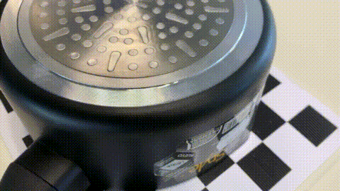
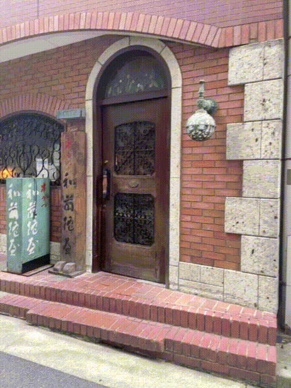
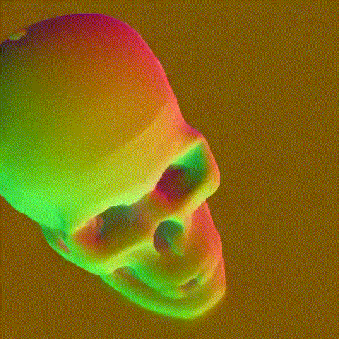

# Nerfstudio XR Tools
## Example Video Frames



## Installation

Check [INSTALL.md](INSTALL.md) for installing all drivers and dependencies in relation to this repo.

## Usage (Scripts)

### Preprocessing scenes of videos and images
Use `process_data.sh` to use `ns-process`, specifying the `GPU`, `TYPE` (whether 'images' or 'video'), `DATASET` (scene folder) and `SFM` (either colmap or hloc) for example:
```
sh process_data.sh 0 images data/nerfstudio/kitchen colmap
```
Alternatively, you can extract the frames from the video using `ffmpeg`, for example at a framerate of 1 fps:
```
ffmpeg -i video.mp4 -vf "fps=1" frame%04d.png
```
For processing an entire dataset (folder of scenes), use `all_process.sh` specifying the `GPU`, `FOLDER` (folder with scenes) and whether to `OVERWRITE` your processed files:
```
sh all_process.sh 0 data/nerfstudio
```
The script `whole_process.sh` will read all folders in `data/`, so that if you want to run all examples that exist in your `data` folder, then:
```
sh whole_process.sh 0
```
### Training Nerfs from images and videos

Use `train.sh` to use `ns-train`, specifying the `GPU`, `MODEL` and `DATASET` (scene folder), for example:
```
sh train.sh 0 nerfacto data/nerfstudio/kitchen
```
For training an entire dataset (folder of scenes), use `all_train.sh` specifying the `GPU`, `MODEL`, `FOLDER` (folder with scenes) and whether to `OVERWRITE` your outputs:
```
sh all_train.sh 0 nerfacto data/nerfstudio true
```
The script `whole_train.sh` will read all folders in `data/`, so that if you want to run all examples that exist in your `data` folder, then:
```
sh whole_train.sh 0 nerfacto
```
Instead, if you want to train all scenes from specific dataset with all models, use the `train_dataset.sh` script specifying the `GPU` and `DATASET`:
```
sh train_dataset.sh 3 data/nerfstudio
```

#### List of current implemented 3D reconstruction [methods in Nerfstudio](https://docs.nerf.studio/nerfology/methods/index.html):
```
vanilla-nerf
vanilla-nerf-blender
mipnerf
nerfacto
nerfacto-big
nerfacto-huge
depth-nerfacto
instant-ngp
instant-ngp-bounded
dnerf
neus
neus-facto
tensorf
volinga
kplanes
kplanes-dynamic
tetra-nerf
tetra-nerf-original
phototourism
splatfacto
pynerf
pynerf-synthetic
pynerf-occupancy-grid
nerfbusters
```
#### Other useful methods (image generation, editing, region proposals, segmentation, video nerfs, etc.)
```
generfacto
in2n
in2n-small
in2n-tiny
igs2gs
lerf
lerf-big
lerf-lite
semantic-nerfw
nerfplayer-nerfacto
nerfplayer-ngp
```
Here is the table of [models](nerfstudio/models) characteristics:

| Model Name     | Field                                                      | Encodings                                                          | Samplers                                  | Renderers                                                         | Losses                                                                 | Default Num Rays                                          | Metrics Dict                                       |
|----------------|------------------------------------------------------------|--------------------------------------------------------------------|-------------------------------------------|-------------------------------------------------------------------|-----------------------------------------------------------------------|-----------------------------------------------------------|----------------------------------------------------|
| vanilla_nerf   | NeRFField(coarse+fine)                                     | NeRFEncoding(position+direction)                                   | UniformSampler, PDFSampler                | RGBRenderer, AccumulationRenderer, DepthRenderer                  | MSELoss                                                              | num_coarse_samples: 64, num_importance_samples: 128       | PSNR, Coarse PSNR, Fine PSNR, Fine SSIM, Fine LPIPS |
| mipnerf        | NeRFField (with integrated encoding)                        | NeRFEncoding(position+direction)                                   | UniformSampler, PDFSampler                | RGBRenderer, AccumulationRenderer, DepthRenderer                  | MSELoss                                                              | Inherits from VanillaModelConfig                          | PSNR, Coarse PSNR, Fine PSNR, Fine SSIM, Fine LPIPS |
| nerfacto       | NerfactoField (HashMLPDensityField)                         | NeRFEncoding(position+direction)                                   | ProposalNetworkSampler (HashMLPDensityField) | RGBRenderer, AccumulationRenderer, DepthRenderer, NormalsRenderer | MSELoss, Interlevel Loss, Distortion Loss, Orientation Loss, Predicted Normal Loss | num_nerf_samples_per_ray: 48, num_proposal_samples_per_ray: (256, 96) | PSNR, SSIM, LPIPS                                  |
| Instant NGP    | NerfactoField (SceneContraction disabled)                   | NeRFEncoding(position+direction, spatial_distortion_enabled)       | VolumetricSampler                        | RGBRenderer, AccumulationRenderer, DepthRenderer                  | MSELoss                                                              | Auto-determined based on scene bounds                    | PSNR, SSIM, LPIPS                                  |
| TensorRF       | TensoRFField (TensorVMEncoding, init_resolution: 128)       | TensorVMEncoding, TriplaneEncoding, TensorCPEncoding               | UniformSampler, PDFSampler                | RGBRenderer, AccumulationRenderer, DepthRenderer                  | MSELoss, TV Loss, L1 Regularization                       | num_uniform_samples: 200, num_samples: 50                  | PSNR, SSIM, LPIPS                                  |
| NeuS           | SurfaceModel (NeuSSampler)                                  | NeRFEncoding (Not applicable as NeuS focuses on SDF)               | NeuSSampler                               | RGBRenderer, AccumulationRenderer, DepthRenderer                  | MSELoss (with focus on surface reconstruction)            | num_samples: 64, num_samples_importance: 64               | PSNR, SSIM, LPIPS, Surface Reconstruction Metrics   |
| NeuSFacto      | NeuSField (ProposalNetworkSampler, HashMLPDensityField)     | NeRFEncoding (SDF based)                                           | ProposalNetworkSampler                    | RGBRenderer, AccumulationRenderer, DepthRenderer                  | MSELoss, Interlevel Loss                                              | num_neus_samples_per_ray: 48, num_proposal_samples_per_ray: (256, 96) | PSNR, SSIM, LPIPS                                  |
| SplatFacto     | Gaussian Splatting                                          | Custom Gaussian Parameters                                         | Custom Gaussian Sampler                   | Custom Splatting Renderer                                          | Custom Losses (SSIM, Scale Regularization)                             | Custom based on Gaussian parameters                      | PSNR, SSIM, LPIPS                                  |
| DepthNerfacto  | NerfactoField augmented with depth                          | Inherits from Nerfacto                                             | Inherits from Nerfacto                    | Inherits from Nerfacto                                             | Inherits from Nerfacto + Depth Loss                       | Inherits from Nerfacto                                    | Inherits from Nerfacto + Depth MSE                |
| SemanticNerfW  | NerfactoField augmented with semantics                      | NeRFEncoding(position+direction, spatial_distortion_enabled)       | ProposalNetworkSampler                    | RGBRenderer, AccumulationRenderer, DepthRenderer, SemanticRenderer | MSELoss, Semantic Cross-Entropy Loss                                   | num_nerf_samples_per_ray: 48, num_proposal_samples_per_ray: (256, 96) | PSNR, SSIM, LPIPS                                  |
| Generfacto     | GenerfactoField (HashMLPDensityField)                       | PositionalTextEmbeddings (location-based prompting)                | ProposalNetworkSampler                    | RGBRenderer, AccumulationRenderer, DepthRenderer, NormalsRenderer | MSELoss, SDS Loss, Distortion Loss, Interlevel Loss, Orientation Loss, Opacity Loss | num_nerf_samples_per_ray: 48, num_proposal_samples_per_ray: (256, 96) | Custom Metrics                                     |

The default [parameters](nerfstudio/configs/method_configs.py) are the following:
| Method Name    | Losses                                             | Proposal Optimizer | Proposal LR | Fields Optimizer | Fields LR | Camera_opt Optimizer | Camera_opt LR | Scheduler                                                                                       | Model and Input                      | Datamanager and Input                                                    | Steps | Max Num Iterations |
|----------------|----------------------------------------------------|--------------------|-------------|------------------|-----------|----------------------|---------------|-------------------------------------------------------------------------------------------------|--------------------------------------|--------------------------------------------------------------------------|-------|---------------------|
| vanilla-nerf   | MSELoss                                            |                    |             | RAdam            | 5e-4      | RAdam                | 5e-4          | ExponentialDecaySchedulerConfig(lr_final=0.0001, max_steps=100000)                             | VanillaModel ()                     | VanillaDataManager()                                                     | 500   | 100000              |
| mipnerf        | MSELoss                                            |                    |             | RAdam            | 5e-4      |                      |               | None                                                                                            | VanillaModel (num_coarse_samples=128, num_importance_samples=128, eval_rays_per_chunk=1024) | VanillaDataManager(train_raysXbatch=1024)                               | 500   | 100000              |
| nerfacto       | MSELoss, distortion_loss, interlevel_loss,orientation_loss, pred_normal_loss         | Adam               | 1e-2        | Adam             | 1e-2      | Adam                 | 1e-3          | ExponentialDecaySchedulerConfig(lr_final=0.0001, max_steps=30000)                              | NerfactoModel (eval_rays_per_chunk=32768) | VanillaDataManager(train_raysXbatch=4096, eval_raysXbatch=4096)        | 500   | 30000               |
| instant-ngp    | MSELoss                                            |                    |             | Adam             | 1e-2      |                      |               | ExponentialDecaySchedulerConfig(lr_final=0.0001, max_steps=100000)                             | InstantNGP (eval_num_rays_per_chunk=8192) | VanillaDataManager(train_raysXbatch=4096, eval_raysXbatch=4096)        | 500   | 100000              |
| tensorf        | MSELoss, total_variation_loss                      |                    |             | Adam             | 0.001     | Adam                 | 0.0001        | ExponentialDecaySchedulerConfig(lr_final=0.0001, max_steps=100000)                             | TensorF (regularization="tv")       | VanillaDataManager(train_raysXbatch=4096, eval_raysXbatch=4096)        | 500   | 100000              |
| semantic-nerfw | MSELoss                                            | Adam               | 1e-2        | Adam             | 1e-2      |                      |               | None                                                                                            | SemanticNerfWModel (eval_rays_per_chunk=65536) | VanillaDataManager(train_raysXbatch=4096, eval_raysXbatch=8192)        | 500   | 100000              |
| dnerf          | MSELoss                                            |                    |             | RAdam            | 5e-4      | RAdam                | 5e-4          | None                                                                                            | VanillaModel (enable_temporal_distortion=True, temporal_distortion_params={"kind": TemporalDistortionKind.DNERF}) | VanillaDataManager()                                                   | 500   | 100000              |
| phototourism   | MSELoss                                            | Adam               | 1e-2        | Adam             | 1e-2      | Adam                 | 1e-3          | ExponentialDecaySchedulerConfig(lr_final=1e-4, max_steps=100000)                                | NerfactoModel (eval_rays_per_chunk=32768) | VanillaDataManager(train_raysXbatch=4096, eval_raysXbatch=4096)        | 500   | 100000              |
| generfacto     | MSELoss                                            | Adam               | 1e-3        | Adam             | 5e-4      |                      |               | None                                                                                            | GenerfactoModel (eval_rays_per_chunk=32768, distortion_loss_mult=1.0, interlevel_loss_mult=100.0, max_res=256, sphere_collider=True, initialize_density=True, taper_range=(0, 2000), random_background=True, proposal_warmup=2000, proposal_update_every=0, proposal_weights_anneal_max_num_iters=2000, start_lambertian_training=500, start_normals_training=2000, opacity_loss_mult=0.001, positional_prompting="discrete", guidance_scale=25) | RandomCamerasDataManager(horizontal_rotation_warmup=3000)            | 500   | 100000              |
| neus           | MSELoss                                            |                    |             | Adam             | 5e-4      |                      |               | None                                                                                            | NeuSModel (eval_rays_per_chunk=1024) | VanillaDataManager(train_raysXbatch=1024, eval_raysXbatch=1024)        | 500   | 100000              |
| neus-facto     | MSELoss                                            | Adam               | 1e-2        | Adam             | 5e-4      | Adam                 | 5e-4          | MultiStepSchedulerConfig(max_steps=20001, milestones=(10000, 1500, 18000))                      | NeuSFactoModel (eval_rays_per_chunk=2048, sdf_field=SDFFieldConfig(num_layers=2, num_layers_color=2, hidden_dim=256, bias=0.5, beta_init=0.8, use_appearance_embedding=False), background_model="none") | VanillaDataManager(train_raysXbatch=2048, eval_raysXbatch=2048)        | 500   | 100000              |
| splatfacto     | MSELoss                                            | Adam               | 0.00016     | Adam             | 0.0025    | Adam                 | 0.001         | ExponentialDecaySchedulerConfig(lr_final=0.0001, max_steps=100000)                              | SplatfactoModel ()                 | FullImageDatamanager(load_3D_points=True, cache_images_type="uint8")  | 500   | 100000              |

### Rendering scenes as videos and gifs

Use `render.sh` to use `ns-render`, specifying the `GPU`, `MODEL`, `DATASET` (scene folder), `RESOL` for resolution scaling (default 1) and `OVERWRITE`:
```
sh render.sh 0 nerfacto data/nerfstudio/kitchen 1 false
```
For rendering all output files, use `all_render.sh` specifying the `GPU`, `RESOL` and whether to `OVERWRITE` your outputs:
```
sh all_render.sh 0 1 false
```

### Evaluating and Benchmarking models
Use `eval.sh` to use `ns-eval`, specifying the `GPU`, `MODEL`, `DATASET` (scene folder):
```
sh eval.sh 0 nerfacto data/nerfstudio/kitchen
```
For rendering all output files, use `all_eval.sh` specifying the `GPU` and whether to `OVERWRITE` your outputs:
```
sh all_eval.sh 0 true
```
The outputs will appear as `.json` in your `outputs/` folder. To stack all the results in one csv you'd need to run `all_benchmark.sh` to convert and stack the results in one unique `.csv`, which will be saved in your `benchmarks/` folder; specifying the `GPU` and the `outputs/` folder (already set by default).
```
sh all_benchmark.sh 0 outputs
```
### Exporting Nerf's 3D scenes to Point Clouds and Meshes
Use `export.sh` to use `ns-export`, specifying the `GPU`, `MODEL`, `DATASET` (scene folder) and `SCALE`:
```
sh export.sh 0 nerfacto data/nerfstudio/kitchen 1
```
For exporting all output files, use `all_export.sh` specifying the `GPU`, `SCALE` and whether to `OVERWRITE` your outputs:
```
sh all_export.sh 0 1 true
```
#### Comparing 3D data
You can also compare `Point Cloud Distances` between algorithms using `open3d`:
```
python compare.py --scene kitchen --type pcd
```
(note: you can add the flag `--visualize True` to view a color-coded [red-green] comparison)

To compare with all the exported examples, use:
```
sh all_compare.sh 0 exports pcd
```
### Demo Showcase - From data to gifs showcase

To view all `data` examples as gifs, use `whole_showcase.sh` specifying the `GPU` and whether to `OVERWRITE` your outputs:
```
sh whole_showcase.sh 0 true
```
For specific dataset cases, use `all_showcase.sh` specifying the `GPU`, `DATASET` (scene folder) and whether to `OVERWRITE` your outputs:
```
sh all_showcase.sh 0 data/nerfstudio/kitchen true
```
You can also visualize examples using `open3d`:
```
python visualize.py --scene kitchen --type mesh
```
## Example Benchmarks

Check [BENCHMARK-AI4H1.md](BENCHMARK-AI4H1.md) for a short benchmark set of `Cultural Heritage` examples.

## Other applications
### Region proposals with [LERF](https://docs.nerf.studio/nerfology/methods/lerf.html)


Installation:
```
python -m pip install git+https://github.com/kerrj/lerf
```
To use LERF we simply need to run our training `train.sh` script selecting the `lerf` model, such as:
```
sh train.sh 0 lerf data/nerfstudio/kitchen
```
Then run the viewer separately, prompting the segmentation category target manually inside the new viewer's lerf textbox.


<table>
  <tr>
    <th>"chair"</th>
    <th>"guitar"</th>
    <th>"walls"</th>
  </tr>
  <tr>
    <th></th>
    <th></th>
    <th></th>
  </tr>
</table>
<table>
  <tr>
    <th>"piano"</th>
    <th>"computer"</th>
    <th>"window"</th>
  </tr>
  <tr>
    <th></th>
    <th></th>
    <th></th>
  </tr>
</table>

### Video Editing (changing 3D style/texture and elements with text)
#### [Instruct-Nerf2Nerf](https://docs.nerf.studio/nerfology/methods/in2n.html) using `nerfacto`

[](https://instruct-nerf2nerf.github.io/data/videos/face.mp4)

Installation:
```
python -m pip install git+https://github.com/ayaanzhaque/instruct-nerf2nerf
```
To use this we built a script `instruct.sh` in which you can run `ns-train in2n` with specific `GPU`, `MODEL`, `DATASET` (scene folder), `PROMPT` (the edit target prompt you can enter), `GSCALE` and `ISCALE`, for example:
```
sh instruct.sh 0 nerfacto data/nerfstudio/kitchen "convert the piano to drums" 7.5 1.5 in2n
```
#### [Instruct-GS2GS](https://docs.nerf.studio/nerfology/methods/igs2gs.html) using Gaussian Splatting

Installation:
```
python -m pip install git+https://github.com/cvachha/instruct-gs2gs
```
To use this we built a script `instruct.sh` in which you can run `ns-train igs2gs` with specific `GPU`, `MODEL`, `DATASET` (scene folder), `PROMPT` (the edit target prompt you can enter), `GSCALE` and `ISCALE`, for example:
```
sh instruct.sh 0 splatfacto data/nerfstudio/kitchen "convert the piano to drums" 12.5 1.5 igs2gs
```

### Playing 3D Videos in [Nerfplayer](https://docs.nerf.studio/nerfology/methods/nerfplayer.html)

[](https://lsongx.github.io/projects/nerfplayer.html)

Installation:
```
python -m pip install git+https://github.com/lsongx/nerfplayer-nerfstudio.git
```
Usage (use either `nerfplayer-ngp` or `nerfplayer-nerfacto`):
```
sh train.sh 0 nerfplayer-ngp data/dycheck/mochi-high-five
```

### Semantic Segmentation with [Semantic Nerf](https://github.com/Harry-Zhi/semantic_nerf)

[](https://shuaifengzhi.com/Semantic-NeRF/)

Usage:
```
sh train.sh 0 semantic-nerfw data/sitcoms3d/Friends-monica_apartment
```

Check Nerfstudio's Semantic-Nerfw Source Code [here](https://docs.nerf.studio/_modules/nerfstudio/models/semantic_nerfw.html)

### 3D model generation with [Generfacto](https://docs.nerf.studio/nerfology/methods/generfacto.html)
"a high quality photo of a pineapple"
[](https://docs.nerf.studio/nerfology/methods/generfacto.html)

Install dependencies (huggingface-hub and diffusers will be authomatically installed from the [requirements.txt](https://raw.githubusercontent.com/dberga/nerfstudio/main/requirements.txt) file)
```
python -m pip install -e .[gen]
```
Create a token for HuggingFace [here](https://huggingface.co/settings/tokens), then login in terminal before running Generfacto.
Note: For DeepFloyd you need to accept the Licence agreement [here](https://huggingface.co/DeepFloyd/IF-I-XL-v1.0) using the account from your access token.
```
huggingface-cli login
```

Example Generfacto run:
```
ns-train generfacto --prompt "a high quality photo of a pineapple" --pipeline.model.diffusion_model "stablediffusion"
```
The first time you run this method, the diffusion model weights will be downloaded and cached from Hugging Face, which may take a couple minutes. Specify which diffusion model to use with the diffusion, either "stablediffusion" or "deepfloyd".

#### Other 3D generation tools (SSDNerf, Text2Nerf, GET3D and Magic3D)
[](https://lakonik.github.io/ssdnerf/)
[](https://eckertzhang.github.io/Text2NeRF.github.io/)
[](https://research.nvidia.com/labs/toronto-ai/GET3D/)
[](https://research.nvidia.com/labs/dir/magic3d/)

