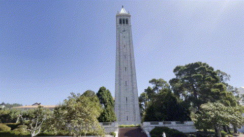

# Nerfstudio XR Tools
## Visual Examples



## Usage (Scripts)

### Preprocessing scenes of videos and images
Use `process_data.sh` to use `ns-process`, specifying the `GPU`, `TYPE` (whether 'images' or 'video') and `DATASET` (scene folder), for example:
```
sh process_data.sh 0 images data/nerfstudio/kitchen
```
For processing an entire dataset (folder of scenes), use `all_process.sh` specifying the `GPU`, `FOLDER` (folder with scenes) and whether to `OVERWRITE` your processed files:
```
sh all_process.sh 0 data/nerfstudio
```
The script `whole_process.sh` will read all folders in `data/`, so that if you want to run all examples that exist in your `data` folder, then:
```
sh whole_process.sh 0
```

### Training Nerfs from images and videos

Use `train.sh` to use `ns-train`, specifying the `GPU`, `MODEL` and `DATASET` (scene folder), for example:
```
sh train.sh 0 nerfacto data/nerfstudio/kitchen
```
For training an entire dataset (folder of scenes), use `all_train.sh` specifying the `GPU`, `MODEL`, `FOLDER` (folder with scenes) and whether to `OVERWRITE` your outputs:
```
sh all_train.sh 0 nerfacto data/nerfstudio true
```
The script `whole_train.sh` will read all folders in `data/`, so that if you want to run all examples that exist in your `data` folder, then:
```
sh whole_train.sh 0 nerfacto
```
#### List of current implemented 3D reconstruction [methods in Nerfstudio](https://docs.nerf.studio/nerfology/methods/index.html):
```
vanilla-nerf
vanilla-nerf-blender
mipnerf
nerfacto
nerfacto-big
nerfacto-huge
depth-nerfacto
instant-ngp
instant-ngp-bounded
dnerf
neus
neus-facto
tensorf
volinga
kplanes
kplanes-dynamic
tetra-nerf
tetra-nerf-original
phototourism
splatfacto
pynerf
pynerf-synthetic
pynerf-occupancy-grid
nerfbusters
```
#### Other useful methods (image generation, editing, region proposals, segmentation, video nerfs, etc.)
```
generfacto
in2n
in2n-small
in2n-tiny
igs2gs
lerf
lerf-big
lerf-lite
semantic-nerfw
nerfplayer-nerfacto
nerfplayer-ngp
```

### Rendering scenes as videos and gifs

Use `render.sh` to use `ns-render`, specifying the `GPU`, `MODEL`, `DATASET` (scene folder), `RESOL` for resolution scaling (default 1) and `OVERWRITE`:
```
sh render.sh 0 nerfacto data/nerfstudio/kitchen 1 false
```
For rendering all output files, use `all_render.sh` specifying the `GPU`, `RESOL` and whether to `OVERWRITE` your outputs:
```
sh all_render.sh 0 1 false
```
### Evaluating and Benchmarking models
Use `eval.sh` to use `ns-eval`, specifying the `GPU`, `MODEL`, `DATASET` (scene folder):
```
sh eval.sh 0 nerfacto data/nerfstudio/kitchen
```
For rendering all output files, use `all_eval.sh` specifying the `GPU` and whether to `OVERWRITE` your outputs:
```
sh all_eval.sh 0 true
```
The outputs will appear as `.json` in your `outputs/` folder. To stack all the results in one csv you'd need to run `all_benchmark.sh` to convert and stack the results in one unique `.csv`, which will be saved in your `benchmarks/` folder; specifying the `GPU` and the `outputs/` folder (already set by default).
```
sh all_benchmark.sh 0 outputs
```
### Exporting Nerf's 3D scenes to Point Clouds and Meshes
Use `export.sh` to use `ns-export`, specifying the `GPU`, `MODEL`, `DATASET` (scene folder) and `SCALE`:
```
sh export.sh 0 nerfacto data/nerfstudio/kitchen 1
```
For exporting all output files, use `all_export.sh` specifying the `GPU`, `SCALE` and whether to `OVERWRITE` your outputs:
```
sh all_export.sh 0 1 true
```
#### Comparing 3D data
You can also compare `Point Cloud Distances` between algorithms using `open3d`:
```
python visualize.py --scene kitchen --type pcd
```
(note: you can add the flag `--visualize True` to view a color-coded [red-green] comparison)

To compare with all the exported examples, use:
```
sh all_compare.sh 0 exports pcd
```
### Demo Showcase - From data to gifs showcase

To view all `data` examples as gifs, use `all_export.sh` specifying the `GPU` and whether to `OVERWRITE` your outputs:
```
sh whole_showcase.sh 0 true
```
For specific dataset cases, use `all_export.sh` specifying the `GPU`, `DATASET` (scene folder) and whether to `OVERWRITE` your outputs:
```
sh all_showcase.sh 0 data/nerfstudio/kitchen true
```
You can also visualize examples using `open3d`:
```
python visualize.py --scene kitchen --type mesh
```

## Benchmarking

The following renders have been done using [Nerfacto](https://docs.nerf.studio/en/latest/nerfology/methods/nerfacto.html) over Nerfstudio scenes and our own captures from the Design and Archeological Museums of Barcelona.


### Nerfstudio scene benchmarks
| Desolation                     |      fps |      lpips |    psnr |       ssim | ckpt_path                                                                               |     fps_std |   lpips_std |   psnr_std |    ssim_std |   coarse_psnr |   coarse_psnr_std |   fine_lpips |   fine_lpips_std |   fine_psnr |   fine_psnr_std |   fine_ssim |   fine_ssim_std |   num_rays_per_sec |   num_rays_per_sec_std |
|:-------------------------------|---------:|-----------:|--------:|-----------:|:----------------------------------------------------------------------------------------|------------:|------------:|-----------:|------------:|--------------:|------------------:|-------------:|-----------------:|------------:|----------------:|------------:|----------------:|-------------------:|-----------------------:|
| vanilla-nerf:2023-08-01_112240 | 0.024383 |          | 13.4243 |          | outputs/desolation/vanilla-nerf/2023-08-01_112240/nerfstudio_models/step-000029999.ckpt | 7.04772e-05 |           |   0.753349 |           |       13.2946 |          0.993983 |     0.910471 |        0.0874608 |     13.4243 |        0.753349 |    0.332045 |       0.0823628 |            12640.2 |                36.5354 |
| nerfacto:2023-07-19_055311     | 0.162767 |   0.300009 | 19.2954 |   0.507008 | outputs/desolation/nerfacto/2023-07-19_055311/nerfstudio_models/step-000029999.ckpt     | 0.00646091  |   0.0797768 |   1.74367  |   0.117849  |             |                 |            |                |           |               |           |               |            84378.4 |              3349.33   |
| instant-ngp:2023-07-18_023251  | 0.127182 |   0.361981 | 19.9634 |   0.599919 | outputs/desolation/instant-ngp/2023-07-18_023251/nerfstudio_models/step-000029999.ckpt  | 0.0313415   |   0.0616219 |   1.29357  |   0.0693649 |             |                 |            |                |           |               |           |               |            65931.1 |             16247.4    |

| Giannini-Hall                  |       fps |      lpips |    psnr |       ssim | ckpt_path                                                                                  |       fps_std |   lpips_std |   psnr_std |   ssim_std |   coarse_psnr |   coarse_psnr_std |   fine_lpips |   fine_lpips_std |   fine_psnr |   fine_psnr_std |   fine_ssim |   fine_ssim_std |   num_rays_per_sec |   num_rays_per_sec_std |
|:-------------------------------|----------:|-----------:|--------:|-----------:|:-------------------------------------------------------------------------------------------|--------------:|------------:|-----------:|-----------:|--------------:|------------------:|-------------:|-----------------:|------------:|----------------:|------------:|----------------:|-------------------:|-----------------------:|
| vanilla-nerf:2023-08-01_034801 | 0.0084192 |          |  9.7106 |          | outputs/Giannini-Hall/vanilla-nerf/2023-08-01_034801/nerfstudio_models/step-000029999.ckpt |   8.86485e-06 |           |   0.632364 |          |       9.79787 |          0.691523 |      1.05464 |        0.0449507 |      9.7106 |        0.632364 |    0.337426 |       0.0847099 |            12662.5 |                13.3327 |
| nerfacto:2023-07-17_232238     | 0.0546089 |   0.471776 | 18.9601 |   0.56257  | outputs/Giannini-Hall/nerfacto/2023-07-17_232238/nerfstudio_models/step-000029999.ckpt     |             |           |          |          |             |                 |            |                |           |               |           |               |            82131.7 |                      |
| nerfacto:2023-07-19_001806     | 0.0566377 |   0.46993  | 18.9768 |   0.563192 | outputs/Giannini-Hall/nerfacto/2023-07-19_001806/nerfstudio_models/step-000029999.ckpt     |   0.00136509  |   0.0960402 |   2.15658  |   0.093453 |             |                 |            |                |           |               |           |               |            85183.2 |              2053.1    |

| kitchen                       |       fps |      lpips |    psnr |       ssim | ckpt_path                                                                           |       fps_std |   lpips_std |   psnr_std |    ssim_std |   coarse_psnr |   coarse_psnr_std |   fine_lpips |   fine_lpips_std |   fine_psnr |   fine_psnr_std |   fine_ssim |   fine_ssim_std |   num_rays_per_sec |   num_rays_per_sec_std |
|:------------------------------|----------:|-----------:|--------:|-----------:|:------------------------------------------------------------------------------------|--------------:|------------:|-----------:|------------:|--------------:|------------------:|-------------:|-----------------:|------------:|----------------:|------------:|----------------:|-------------------:|-----------------------:|
| mipnerf:2023-07-05_123711     | 0.0158944 |          | 11.1784 |          | outputs/kitchen/mipnerf/2023-07-05_123711/nerfstudio_models/step-001000000.ckpt     |   1.98905e-05 |           |    1.6323  |           |       10.1891 |           1.65947 |     0.872216 |        0.0714517 |     11.1784 |          1.6323 |    0.418869 |        0.118817 |            11659.7 |                14.5912 |
| nerfacto:2023-06-29_134711    | 0.115752  |   0.316295 | 20.2726 |   0.785107 | outputs/kitchen/nerfacto/2023-06-29_134711/nerfstudio_models/step-000029999.ckpt    |             |           |          |           |             |                 |            |                |           |               |           |               |            84912.2 |                      |
| nerfacto:2023-07-19_100644    | 0.114276  |   0.312058 | 20.4094 |   0.788911 | outputs/kitchen/nerfacto/2023-07-19_100644/nerfstudio_models/step-000029999.ckpt    |   0.00451316  |   0.0890401 |    3.18618 |   0.0741932 |             |                 |            |                |           |               |           |               |            83829.8 |              3310.73   |
| instant-ngp:2023-07-18_054020 | 0.0514637 |   0.310813 | 20.4544 |   0.796872 | outputs/kitchen/instant-ngp/2023-07-18_054020/nerfstudio_models/step-000029999.ckpt |   0.00648508  |   0.0852937 |    3.22339 |   0.0723424 |             |                 |            |                |           |               |           |               |            37752.4 |              4757.27   |

| Egypt                          |       fps |      lpips |    psnr |       ssim | ckpt_path                                                                          |       fps_std |   lpips_std |   psnr_std |   ssim_std |   coarse_psnr |   coarse_psnr_std |   fine_lpips |   fine_lpips_std |   fine_psnr |   fine_psnr_std |   fine_ssim |   fine_ssim_std |   num_rays_per_sec |   num_rays_per_sec_std |
|:-------------------------------|----------:|-----------:|--------:|-----------:|:-----------------------------------------------------------------------------------|--------------:|------------:|-----------:|-----------:|--------------:|------------------:|-------------:|-----------------:|------------:|----------------:|------------:|----------------:|-------------------:|-----------------------:|
| vanilla-nerf:2023-08-01_015311 | 0.0244074 |          | 12.5865 |          | outputs/Egypt/vanilla-nerf/2023-08-01_015311/nerfstudio_models/step-000029999.ckpt |   0.000124289 |           |    1.25218 |          |       12.7633 |           1.20794 |     0.967278 |        0.0739801 |     12.5865 |         1.25218 |    0.417619 |       0.0995492 |            12652.8 |                64.4315 |
| nerfacto:2023-07-18_225346     | 0.170045  |   0.35702  | 20.8356 |   0.638194 | outputs/Egypt/nerfacto/2023-07-18_225346/nerfstudio_models/step-000029999.ckpt     |   0.00918191  |    0.101257 |    2.37266 |   0.108798 |             |                 |            |                |           |               |           |               |            88151.3 |              4759.9    |
| instant-ngp:2023-07-17_213553  | 0.179025  |   0.410446 | 19.9326 |   0.605525 | outputs/Egypt/instant-ngp/2023-07-17_213553/nerfstudio_models/step-000029999.ckpt  |             |           |          |          |             |                 |            |                |           |               |           |               |            92806.5 |                      |

### Our scene benchmarks

| bustos_porcelana              |       fps |      lpips |    psnr |       ssim | ckpt_path                                                                                    |       fps_std |   lpips_std |   psnr_std |     ssim_std |   num_rays_per_sec |   num_rays_per_sec_std |   coarse_psnr |   coarse_psnr_std |   fine_lpips |   fine_lpips_std |   fine_psnr |   fine_psnr_std |   fine_ssim |   fine_ssim_std |
|:------------------------------|----------:|-----------:|--------:|-----------:|:---------------------------------------------------------------------------------------------|--------------:|------------:|-----------:|-------------:|-------------------:|-----------------------:|--------------:|------------------:|-------------:|-----------------:|------------:|----------------:|------------:|----------------:|
| lerf-lite:2023-07-17_222319   | 0.0107    |   0.133367 | 31.5117 |   0.942257 | outputs/bustos_porcelana/lerf-lite/2023-07-17_222319/nerfstudio_models/step-000029999.ckpt   |   2.37195e-05 |   0.0133382 |   0.342493 |   0.00611185 |             5546.9 |                12.2962 |             |                 |            |                |           |               |           |               |
| mipnerf:2023-07-18_142239     | 0.0224392 |          | 15.5664 |          | outputs/bustos_porcelana/mipnerf/2023-07-18_142239/nerfstudio_models/step-000278000.ckpt     |   0.000104159 |           |   0.990769 |            |            11632.5 |                53.9962 |       15.2857 |          0.967794 |     0.690788 |        0.0789041 |     15.5664 |        0.990769 |    0.674403 |       0.0541597 |
| nerfacto:2023-07-08_074217    | 0.160992  |   0.120344 | 31.0397 |   0.944007 | outputs/bustos_porcelana/nerfacto/2023-07-08_074217/nerfstudio_models/step-000029999.ckpt    |             |           |          |            |            83458.4 |                      |             |                 |            |                |           |               |           |               |
| nerfacto:2023-07-18_114042    | 0.16111   |   0.123402 | 30.8878 |   0.941951 | outputs/bustos_porcelana/nerfacto/2023-07-18_114042/nerfstudio_models/step-000029999.ckpt    |   0.0068725   |   0.0240363 |   1.48954  |   0.0141703  |            83519.3 |              3562.71   |             |                 |            |                |           |               |           |               |
| instant-ngp:2023-07-17_141222 | 0.103637  |   0.11327  | 31.5718 |   0.950721 | outputs/bustos_porcelana/instant-ngp/2023-07-17_141222/nerfstudio_models/step-000029999.ckpt |   0.00837329  |   0.0253395 |   1.53187  |   0.0126404  |            53725.5 |              4340.72   |             |                 |            |                |           |               |           |               |

| casco_ceramico                 |       fps |      lpips |    psnr |       ssim | ckpt_path                                                                                   |       fps_std |   lpips_std |   psnr_std |    ssim_std |   coarse_psnr |   coarse_psnr_std |   fine_lpips |   fine_lpips_std |   fine_psnr |   fine_psnr_std |   fine_ssim |   fine_ssim_std |   num_rays_per_sec |   num_rays_per_sec_std |
|:-------------------------------|----------:|-----------:|--------:|-----------:|:--------------------------------------------------------------------------------------------|--------------:|------------:|-----------:|------------:|--------------:|------------------:|-------------:|-----------------:|------------:|----------------:|------------:|----------------:|-------------------:|-----------------------:|
| vanilla-nerf:2023-07-31_180116 | 0.0243785 |          | 10.3615 |          | outputs/casco_ceramico/vanilla-nerf/2023-07-31_180116/nerfstudio_models/step-000029999.ckpt |   6.35772e-05 |           |    1.77634 |           |       10.1578 |           1.86723 |     0.835905 |         0.043814 |     10.3615 |         1.77634 |     0.58555 |       0.0608247 |            12637.8 |                32.9585 |
| nerfacto:2023-07-08_063026     | 0.162456  |   0.267659 | 27.0221 |   0.866817 | outputs/casco_ceramico/nerfacto/2023-07-08_063026/nerfstudio_models/step-000029999.ckpt     |             |           |          |           |             |                 |            |                |           |               |           |               |            84217.4 |                      |
| nerfacto:2023-07-18_154827     | 0.161328  |   0.270297 | 26.5753 |   0.860599 | outputs/casco_ceramico/nerfacto/2023-07-18_154827/nerfstudio_models/step-000029999.ckpt     |   0.0057616   |   0.0847185 |    4.5152  |   0.0769442 |             |                 |            |                |           |               |           |               |            83632.3 |              2986.81   |
| instant-ngp:2023-07-17_173513  | 0.125298  |   0.299986 | 24.3032 |   0.852131 | outputs/casco_ceramico/instant-ngp/2023-07-17_173513/nerfstudio_models/step-000029999.ckpt  |   0.0214665   |   0.065113  |    2.831   |   0.0466577 |             |                 |            |                |           |               |           |               |            64954.2 |             11128.2    |

| cobi_metal                    |       fps |    lpips |    psnr |     ssim | ckpt_path                                                                              |       fps_std |   lpips_std |   psnr_std |     ssim_std |   num_rays_per_sec |   num_rays_per_sec_std |
|:------------------------------|----------:|---------:|--------:|---------:|:---------------------------------------------------------------------------------------|--------------:|------------:|-----------:|-------------:|-------------------:|-----------------------:|
| lerf-lite:2023-07-18_022614   | 0.0106688 | 0.195439 | 28.3808 | 0.923771 | outputs/cobi_metal/lerf-lite/2023-07-18_022614/nerfstudio_models/step-000029999.ckpt   |   8.59243e-05 |   0.0312403 |   0.536121 |   0.00442066 |            5530.72 |                44.5432 |
| nerfacto:2023-07-07_175631    | 0.160869  | 0.183045 | 28.5234 | 0.92659  | outputs/cobi_metal/nerfacto/2023-07-07_175631/nerfstudio_models/step-000029999.ckpt    |             |           |          |            |           83394.4  |                      |
| nerfacto:2023-07-18_130434    | 0.163124  | 0.186662 | 28.0525 | 0.926744 | outputs/cobi_metal/nerfacto/2023-07-18_130434/nerfstudio_models/step-000029999.ckpt    |   0.00713964  |   0.0253794 |   2.13372  |   0.0203348  |           84563.5  |              3701.19   |
| instant-ngp:2023-07-17_150401 | 0.169869  | 0.230064 | 27.4068 | 0.926034 | outputs/cobi_metal/instant-ngp/2023-07-17_150401/nerfstudio_models/step-000029999.ckpt |   0.0239023   |   0.0288744 |   2.31653  |   0.0128367  |           88060.1  |             12391      |

| jarrones_vidrio                |       fps |      lpips |    psnr |       ssim | ckpt_path                                                                                    |       fps_std |   lpips_std |   psnr_std |    ssim_std |   coarse_psnr |   coarse_psnr_std |   fine_lpips |   fine_lpips_std |   fine_psnr |   fine_psnr_std |   fine_ssim |   fine_ssim_std |   num_rays_per_sec |   num_rays_per_sec_std |
|:-------------------------------|----------:|-----------:|--------:|-----------:|:---------------------------------------------------------------------------------------------|--------------:|------------:|-----------:|------------:|--------------:|------------------:|-------------:|-----------------:|------------:|----------------:|------------:|----------------:|-------------------:|-----------------------:|
| vanilla-nerf:2023-07-31_195835 | 0.0243836 |          | 15.4029 |          | outputs/jarrones_vidrio/vanilla-nerf/2023-07-31_195835/nerfstudio_models/step-000029999.ckpt |   6.88209e-05 |           |    1.33898 |           |       14.9349 |           1.30204 |     0.600841 |        0.0608053 |     15.4029 |         1.33898 |    0.852373 |       0.0297975 |            12640.5 |                35.6768 |
| nerfacto:2023-07-18_171436     | 0.169313  |   0.207251 | 31.7724 |   0.947912 | outputs/jarrones_vidrio/nerfacto/2023-07-18_171436/nerfstudio_models/step-000029999.ckpt     |   0.00683707  |   0.0406464 |    2.40678 |   0.0139532 |             |                 |            |                |           |               |           |               |            87771.8 |              3544.34   |
| nerfacto:2023-07-08_211927     | 0.163946  |   0.204076 | 31.517  |   0.949209 | outputs/jarrones_vidrio/nerfacto/2023-07-08_211927/nerfstudio_models/step-000029999.ckpt     |             |           |          |           |             |                 |            |                |           |               |           |               |            84989.5 |                      |

| maniquis_terciopelo           |      fps |    lpips |    psnr |     ssim | ckpt_path                                                                                       |      fps_std |   lpips_std |   psnr_std |    ssim_std |   num_rays_per_sec |   num_rays_per_sec_std |
|:------------------------------|---------:|---------:|--------:|---------:|:------------------------------------------------------------------------------------------------|-------------:|------------:|-----------:|------------:|-------------------:|-----------------------:|
| nerfacto:2023-07-10_023232    | 0.164702 | 0.22665  | 25.9759 | 0.848632 | outputs/maniquis_terciopelo/nerfacto/2023-07-10_023232/nerfstudio_models/step-000029999.ckpt    |            |           |          |           |            85381.3 |                      |
| nerfacto:2023-07-18_142444    | 0.162216 | 0.226258 | 25.7346 | 0.8415   | outputs/maniquis_terciopelo/nerfacto/2023-07-18_142444/nerfstudio_models/step-000029999.ckpt    |   0.00700003 |   0.0600774 |    4.36009 |   0.0581581 |            84092.7 |                3628.81 |
| instant-ngp:2023-07-17_161759 | 0.101778 | 0.203582 | 26.9513 | 0.876102 | outputs/maniquis_terciopelo/instant-ngp/2023-07-17_161759/nerfstudio_models/step-000029999.ckpt |   0.0100873  |   0.0663312 |    4.5219  |   0.0273727 |            52761.5 |                5229.25 |

## Other applications
### Region proposals with [LERF](https://docs.nerf.studio/nerfology/methods/lerf.html)


Installation:
```
python -m pip install git+https://github.com/kerrj/lerf
```
To use LERF we simply need to run our training `train.sh` script selecting the `lerf` model, such as:
```
sh train.sh 0 lerf data/nerfstudio/kitchen
```
Then run the viewer separately, prompting the segmentation category target manually inside the new viewer's lerf textbox.


<table>
  <tr>
    <th>"chair"</th>
    <th>"guitar"</th>
    <th>"walls"</th>
  </tr>
  <tr>
    <th></th>
    <th></th>
    <th></th>
  </tr>
</table>
<table>
  <tr>
    <th>"piano"</th>
    <th>"computer"</th>
    <th>"window"</th>
  </tr>
  <tr>
    <th></th>
    <th></th>
    <th></th>
  </tr>
</table>

### Video Editing (changing 3D style/texture and elements with text)
#### [Instruct-Nerf2Nerf](https://docs.nerf.studio/nerfology/methods/in2n.html) using `nerfacto`

[](https://instruct-nerf2nerf.github.io/data/videos/face.mp4)

Installation:
```
python -m pip install git+https://github.com/ayaanzhaque/instruct-nerf2nerf
```
To use this we built a script `instruct.sh` in which you can run `ns-train in2n` with specific `GPU`, `MODEL`, `DATASET` (scene folder), `PROMPT` (the edit target prompt you can enter), `GSCALE` and `ISCALE`, for example:
```
sh instruct.sh 0 nerfacto data/nerfstudio/kitchen "convert the piano to drums" 7.5 1.5 in2n
```
#### [Instruct-GS2GS](https://docs.nerf.studio/nerfology/methods/igs2gs.html) using Gaussian Splatting

Installation:
```
python -m pip install git+https://github.com/cvachha/instruct-gs2gs
```
To use this we built a script `instruct.sh` in which you can run `ns-train igs2gs` with specific `GPU`, `MODEL`, `DATASET` (scene folder), `PROMPT` (the edit target prompt you can enter), `GSCALE` and `ISCALE`, for example:
```
sh instruct.sh 0 splatfacto data/nerfstudio/kitchen "convert the piano to drums" 12.5 1.5 igs2gs
```

### Playing 3D Videos in [Nerfplayer](https://docs.nerf.studio/nerfology/methods/nerfplayer.html)

[](https://lsongx.github.io/projects/nerfplayer.html)

Installation:
```
python -m pip install git+https://github.com/lsongx/nerfplayer-nerfstudio.git
```
Usage (use either `nerfplayer-ngp` or `nerfplayer-nerfacto`):
```
sh train.sh 0 nerfplayer-ngp data/dycheck/mochi-high-five
```

### Semantic Segmentation with [Semantic Nerf](https://github.com/Harry-Zhi/semantic_nerf)

[](https://shuaifengzhi.com/Semantic-NeRF/)

Usage:
```
sh train.sh 0 semantic-nerfw data/sitcoms3d/Friends-monica_apartment
```

Check Nerfstudio's Semantic-Nerfw Source Code [here](https://docs.nerf.studio/_modules/nerfstudio/models/semantic_nerfw.html)

### 3D model generation with [Generfacto](https://docs.nerf.studio/nerfology/methods/generfacto.html)
"a high quality photo of a pineapple"
[](https://docs.nerf.studio/nerfology/methods/generfacto.html)

Install dependencies (huggingface-hub and diffusers will be authomatically installed from the [requirements.txt](https://raw.githubusercontent.com/dberga/nerfstudio/main/requirements.txt) file)
```
python -m pip install -e .[gen]
```
Create a token for HuggingFace [here](https://huggingface.co/settings/tokens), then login in terminal before running Generfacto.
Note: For DeepFloyd you need to accept the Licence agreement [here](https://huggingface.co/DeepFloyd/IF-I-XL-v1.0) using the account from your access token.
```
huggingface-cli login
```

Example Generfacto run:
```
ns-train generfacto --prompt "a high quality photo of a pineapple" --pipeline.model.diffusion_model "stablediffusion"
```
The first time you run this method, the diffusion model weights will be downloaded and cached from Hugging Face, which may take a couple minutes. Specify which diffusion model to use with the diffusion, either "stablediffusion" or "deepfloyd".

#### Other 3D generation tools (SSDNerf, Text2Nerf, GET3D and Magic3D)
[](https://lakonik.github.io/ssdnerf/)
[](https://eckertzhang.github.io/Text2NeRF.github.io/)
[](https://research.nvidia.com/labs/toronto-ai/GET3D/)
[](https://research.nvidia.com/labs/dir/magic3d/)

## Installation: Setup your Nerfstudio Package

Nerfstudio requires `python >= 3.8`. We recommend using conda to manage dependencies. Make sure to install [Conda](https://docs.conda.io/miniconda.html) before proceeding.

```bash
conda create --name nerfstudio -y python=3.8
conda activate nerfstudio
python -m pip install --upgrade pip
python -m pip install --upgrade pip setuptools
```

Install PyTorch with CUDA (this repo has been tested with CUDA 11.7 and CUDA 12.3) and [tiny-cuda-nn](https://github.com/NVlabs/tiny-cuda-nn). `cuda-toolkit` is required for building `tiny-cuda-nn`.

For CUDA 11.7
```bash
python -m pip install torch==2.0.1+cu117 --extra-index-url https://download.pytorch.org/whl/cu117
python -m pip install torchvision==0.15.2+cu117 torchaudio==2.0.1+cu117 --extra-index-url https://download.pytorch.org/whl/cu117
python -m pip install torch-scatter -f https://data.pyg.org/whl/torch-2.0.1+cu117.html

conda install -c "nvidia/label/cuda-11.7.1" cuda-toolkit
python -m pip install ninja git+https://github.com/NVlabs/tiny-cuda-nn/#subdirectory=bindings/torch
```
For CUDA 12 and above
```bash
python -m pip install torch==2.1.1 --extra-index-url https://download.pytorch.org/whl/cu121
python -m pip install torchvision==0.16.1 torchaudio==2.1.1 --extra-index-url https://download.pytorch.org/whl/cu121
python -m pip install torch-scatter -f https://data.pyg.org/whl/torch-2.1.1+cu121.html

conda install -c "nvidia/label/cuda-12.3.0" cuda-toolkit
python -m pip install ninja git+https://github.com/NVlabs/tiny-cuda-nn/#subdirectory=bindings/torch
```
After installing torch, install nerfstudio's requirements:
```bash
python -m pip install -r requirements.txt --force-reinstall --ignore-installed --no-deps
```

Installing your Nerfstudio package
```bash
python -m pip install -e . --ignore-installed --force-reinstall --no-deps
```
See [Dependencies](https://github.com/nerfstudio-project/nerfstudio/blob/main/docs/quickstart/installation.md#dependencies) in the Installation documentation for more.

## Installation: Colmap and Hloc data preprocessing (SfM tools) for GPU

Install prior dependencies:
```bash
sudo apt-get install \
    git \
    cmake \
    ninja-build \
    build-essential \
    libboost-program-options-dev \
    libboost-filesystem-dev \
    libboost-graph-dev \
    libboost-system-dev \
    libeigen3-dev \
    libflann-dev \
    libfreeimage-dev \
    libmetis-dev \
    libgoogle-glog-dev \
    libgtest-dev \
    libsqlite3-dev \
    libglew-dev \
    qtbase5-dev \
    libqt5opengl5-dev \
    libcgal-dev \
    libceres-dev
```
Build and compile Colmap (make sure you are back to base environment)
```bash
git clone https://github.com/colmap/colmap.git
cd colmap
mkdir build
cd build
cmake .. -GNinja -DCMAKE_CUDA_ARCHITECTURES=native
sudo chown -R $(whoami) .
ninja
sudo ninja install
```
Install Hloc (make sure you are in your nerfstudio's environment)
```bash
git clone --recursive https://github.com/cvg/Hierarchical-Localization/
cd Hierarchical-Localization
python -m pip install -e .
```
See the [Colmap Installation](https://colmap.github.io/install.html) and [Hloc Installation](https://github.com/cvg/Hierarchical-Localization#installation) documentation for more.
## Installation: ffmpeg for rendering
```bash
sudo apt install ffmpeg
```
